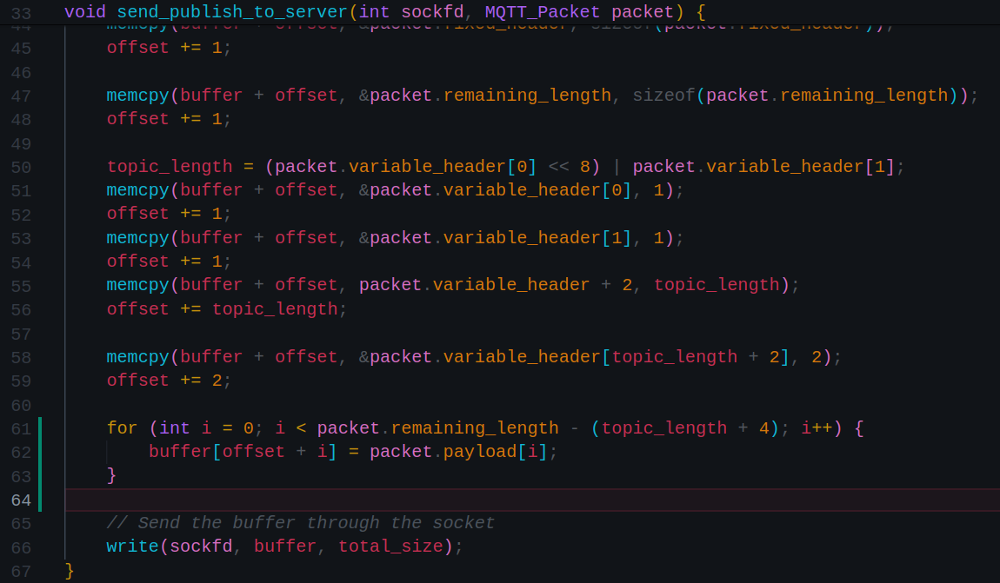
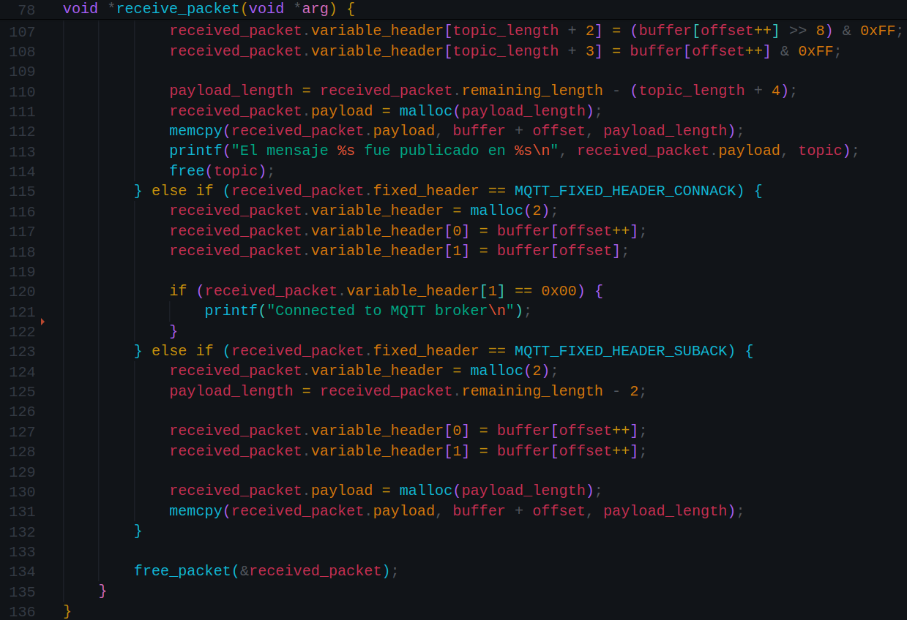

# MQTT
## Table of Contents
- [Introduction](https://github.com/JuanM0412/MQTT/tree/master?tab=readme-ov-file#introduction)
- [Achievements-and-Limitations](https://github.com/JuanM0412/MQTT/tree/master?tab=readme-ov-file#achievements-and-limitations)
- [Selected socket type](https://github.com/JuanM0412/MQTT/tree/master?tab=readme-ov-file#selected-socket-type-stream-sock_stream-or-datagram-sock_dgram)
- [Conclusions](https://github.com/JuanM0412/MQTT/tree/master?tab=readme-ov-file#conclusions)
- [References](https://github.com/JuanM0412/MQTT/tree/master?tab=readme-ov-file#references)

## Introduction
MQTT (Message Queuing Telemetry Transport) is a lightweight messaging protocol widely used in IoT for its low bandwidth consumption. It is based on the client-server model. IBM developed MQTT in the 1990s, but since then, the open-source community has adopted it, making it an open standard primarily driven by Oasis.

The communication model of MQTT follows a publish/subscribe approach, which is a messaging pattern where message senders (called "publishers") do not send messages directly to specific recipients, but instead publish messages to "topics." Message receivers (called "subscribers") subscribe to one or more topics and automatically receive messages published on those topics.

This project was carried out by a team of three developers and lasted a little over 4 weeks for its design, planning, and execution in the C programming language.
## Development and implementation details
In the initial stages, the first approach to the protocol was made, a search for its documentation was conducted, and it was decided to implement version 3.1.1 hosted on the official website of Oasis Open.

Due to the limited time available, the design period had to be very brief and fast, and on the go, as relevant corrections were seen, they were executed.

With a team of three people, it was considered that the most appropriate way to distribute the work was for one person to be in charge of the client application and logs, and two people to be in charge of the MQTT broker application. In this case, of the two people working within the broker, one managed everything related to packet structure and handling of concurrent connections, while the other was in charge of managing topics, the data structure to be used (n-ary tree), sending messages to subscribers, and receiving publications.

### Selected socket type. Stream (SOCK_STREAM)" or "Datagram (SOCK_DGRAM)"

The selected socket type was Stream, supported by:

Connection reliability: MQTT is a TCP/IP-based protocol that requires a reliable and stable connection between the client and server. Stream sockets (SOCK_STREAM) provide a reliable, bidirectional connection ideal for MQTT communication. Datagram, on the other hand, operates with UDP.

Widely compatible: Since MQTT is based on TCP/IP, most MQTT broker implementations are built on stream sockets due to their wide compatibility and reliability.

Suitable for applications requiring continuous data transmission, and it also allows bidirectional communication, ideal for MQTT implementation purposes.

## Achievements and Limitations
Among the achieved aspects, it is worth highlighting the ability to handle multiple concurrent connections within the same server. An efficient data structure for storing messages and users associated with each topic was also successfully implemented, along with a streamlined structure for handling packets, including encoding, decoding algorithms, and interactions with the topic tree.

As for the aspects not achieved, the main one is the implementation of a higher quality of service (QoS) (only QoS 0 was implemented). It would have been very interesting to implement QoS 1 or 2.

This is also related to the first aspect not achieved, which was the issue of persistent sessions after disconnections.

Finally, another aspect that was not developed was the unsubscribe message type. Time was the determining factor preventing the implementation of these functionalities. However, with the foundation laid, their implementation should not take much time or effort.
- [X] Connect
- [X] Subscribe
- [X] Publish
- [X] Disconnect
- [X] Log Server
- [ ] Log Client
## Conclusions
- Developing the protocol yields a wealth of valuable learnings, not only in terms of soft skills but also technical skills. For instance, it involves crafting a concurrent application for message transmission and reception via sockets and implementing optimal data structures to represent our logical models in code.

- Time management and task allocation are pivotal yet often overlooked factors in software project development. With proper planning and effective team distribution, the result is likely to be positive.

- Implementing a protocol according to formal specifications is challenging but not impossible. Confronting such a technical document can be daunting yet ultimately rewarding.

## References
- [Playing with UTF-8 in C++](https://mobiarch.wordpress.com/2022/12/03/playing-with-utf-8-in-c/)
- [UTF-8 strings in C](https://dev.to/rdentato/utf-8-strings-in-c-1-3-42a4)
- [MQTT](http://docs.oasis-open.org/mqtt/mqtt/v3.1.1/os/mqtt-v3.1.1-os.pdf)

## Changes

### send_packets_to_server.c

### server.c
.png)
.png)
.png)
.png)

### client.c
